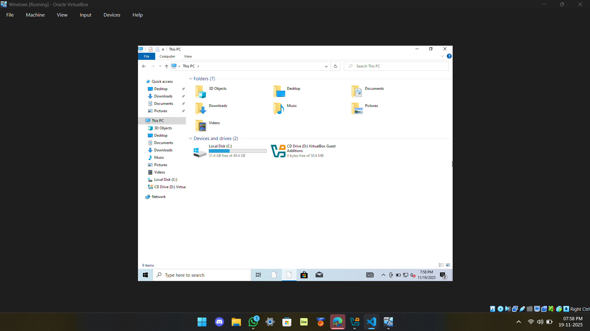
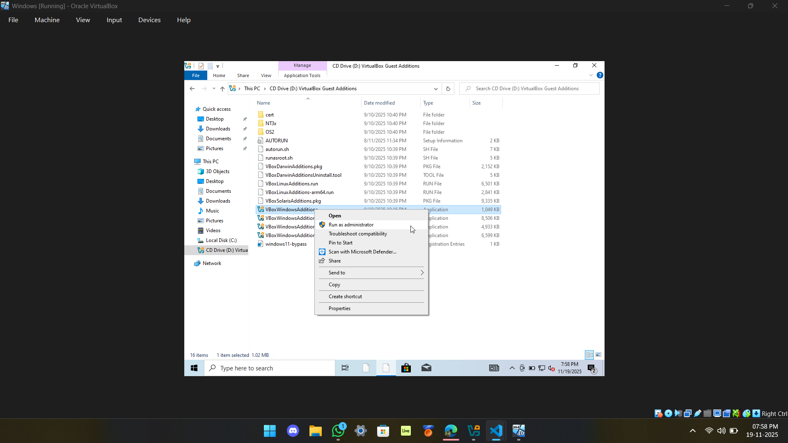
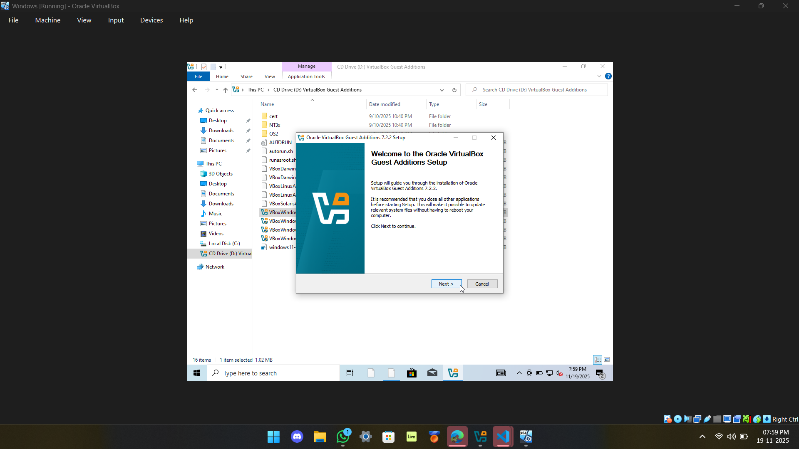
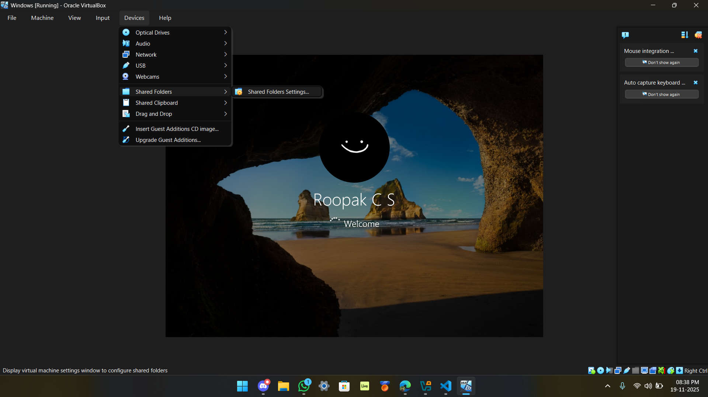
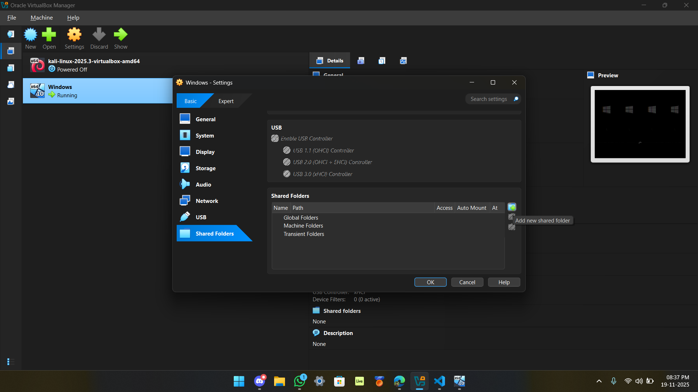
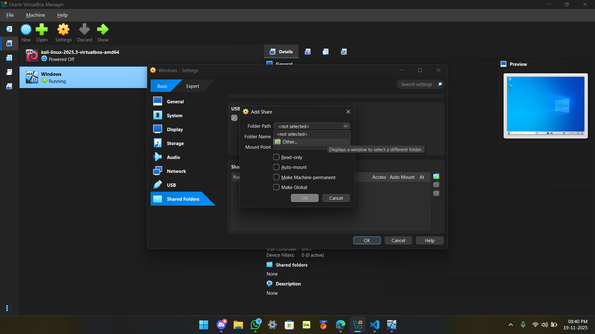
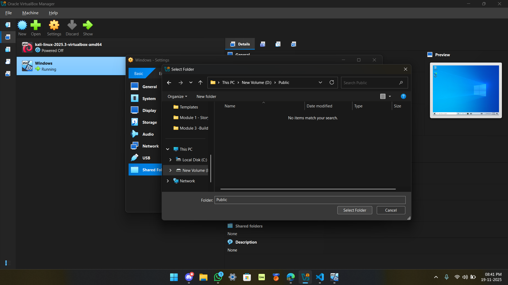
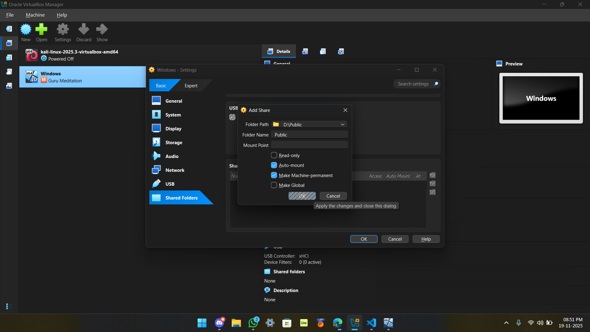

# **EXPERIMENT 6: MOVING FILES BETWEEN VIRTUAL MACHINES**

## **Aim**

To move files between virtual machines.

You can move files between virtual machines in several ways:

-   You can copy files using network utilities just like you would between physical computers.
-   To do this between two virtual machines:
    -   Both VMs must be configured to allow network access.
    -   Any networking method (Host-Only, Bridged, NAT) can be used.
    -   With **Host-Only networking**, you copy files between VM ↔ Host ↔ VM.
    -   With **Bridged** or **NAT**, you can directly transfer files between VMs.
-   You can also create a **shared drive** (virtual disk or raw partition) and mount it on both virtual machines.

---

# **Procedure**

## **How to Enable File Sharing in VirtualBox**

---

## **Step 1: Install Guest Additions on the Guest Machine**

1. Start the VirtualBox Guest Machine (OS).
2. From the VirtualBox menu, select:  
   **Devices → Install Guest Additions**
3. Steps inside the guest OS:
    - Open **File Explorer**.
    - Double-click **CD Drive (X:) VirtualBox Guest Additions** to view its contents.
      
    - Right-click **VBoxWindowsAdditions** and choose **Run as administrator**.
      
    - Click **Next** and follow the on-screen instructions to complete installation.
      
    - When finished, click **Finish** and restart the guest machine.

---

## **Step 2: Set Up File Sharing on VirtualBox Guest Machine**

1. From the VirtualBox window, click:  
   **Devices → Shared Folders → Shared Folder Settings**
   
2. Click the **Add new shared folder** icon (folder with a plus sign).
   
3. In the Folder Path dropdown, click **Other…**
   
4. Select the folder from the Host OS that you want to share.  
   _(Tip: Create a new folder on your host named something recognizable, e.g., "Public")_
   
5. In the **Add Share** window:
    - Enter a folder name (optional)
    - Enable **Auto-mount**
    - Enable **Make Permanent**
    
6. Click **OK** twice to save settings.

---

## **Accessing the Shared Folder**

-   Open **File Explorer** in the Guest OS.
-   Under **Network Locations**, you will see a new network drive pointing to the shared folder on the host.

---

# **Result**

Thus, file sharing between virtual machines has been successfully enabled, and files can now be moved from one virtual machine to another.
